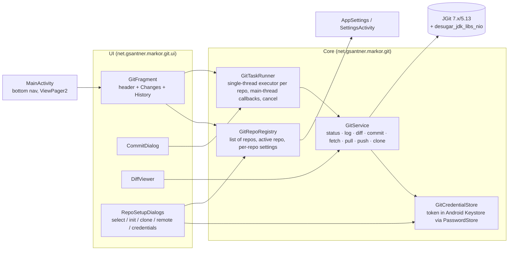

# Git tab roadmap — replacing the "More" tab with git pull / commit / push

Last updated 2026-09-13.
Baseline: Markor **v2.16.1** (tag `v2.16.1`, commit `f33eb6a8`, released 2026-03-19). minSdk 18, compileSdk 35, Java 8 source level, AGP 8.13.2, Gradle 8.13, CI on Java 21.

## 0. Summary and decisions taken up front

**Goal.** Replace the "More" bottom-navigation tab with a **Git** tab. From that tab a user can pick a working folder (a git repository), see uncommitted changes, browse commit history with diffs, write a message and commit, pull updates from the remote, and push.

**Decisions that shape everything below**

| # | Decision | Why |
|---|----------|-----|
| D1 | **This is a fork feature, not an upstream PR.** | Upstream issue [#2185 "Integrate git with Markor editor"](https://github.com/gsantner/markor/issues/2185) was closed by the maintainer with: *"I don't plan to add .. git support, cloning, pushing/pulling and especially merge conflict stuff ... to Markor. Synchronization is not what Markor does."* Co-maintainer harshad1 agreed. Plan for a long-lived fork branch and keep the feature isolated (one new package, few touch points) so rebasing onto upstream `master` stays cheap. |
| D2 | **Engine: JGit** (pure Java). | Keeps the README rule "No dependency on NDK, 1 APK = all architectures". JGit is testable in plain JVM unit tests, which Markor already has (JUnit 4 + AssertJ). Version is chosen by the Phase 1 spike: candidates `7.8.0` (Java 17 bytecode, latest), `6.10.1` (Java 11), `5.13.5` (Java 8, security-fix branch). |
| D3 | **java.nio.file via core-library desugaring**, minSdk stays 18 if the spike passes. | Every JGit ≥ 4 uses `java.nio.file`, which Android only has from API 26. `com.android.tools:desugar_jdk_libs_nio:2.1.5` back-fills it. Fallback: raise the fork's minSdk to 26. (MGit, the best-known Android git client, avoids this only by pinning JGit 3.7 from 2015.) |
| D4 | **Transport: HTTPS + personal access token first.** SSH is a later phase. | JGit's SSH stack (Apache MINA sshd) is unproven on Android and heavy. HTTPS with a token covers GitHub, GitLab, Gitea/Forgejo, Codeberg. |
| D5 | **Conflicts are resolved in the editor.** | Markor is a text editor. On a conflicting pull, leave git's conflict markers in the files, list them in the Git tab, open them in the editor, then "Mark resolved and commit". No three-way merge UI. |
| D6 | **Primary/internal storage only.** | JGit works on `java.io.File`. Folders reached through the Storage Access Framework (SD cards) cannot be repositories. Markor already requests `MANAGE_EXTERNAL_STORAGE`, so anything under `/storage/emulated/0` works. |
| D7 | **Existing "More" content moves into Settings.** | The About / community / licenses list (`MoreInfoFragment`) is kept and reached from a new Settings entry, so nothing is lost. |

**Environment note.** This machine (SteamOS) has no JDK and no Android SDK, so nothing can be compiled here until Phase 0.2 is done. Everything in this document was derived from reading the source and the public Maven / GitHub metadata.

## 1. Integration points in v2.16.1

| File | Role today | Change |
|------|------------|--------|
| `app/src/main/res/menu/main__bottom_nav.xml` | Four tabs: `nav_notebook`, `nav_todo`, `nav_quicknote`, `nav_more` | Replace `nav_more` with `nav_git` (icon `ic_sync_black_24dp` exists; a dedicated git-branch icon is nicer) |
| `app/src/main/java/net/gsantner/markor/activity/MainActivity.java` | `ViewPager2` + `SectionsPagerAdapter`; tab position, title and fragment are hard-coded in `tabIdToPos`, `getPosTitle`, `getPosFragment`, `createFragment`, `onSaveInstanceState`, `onRestoreInstanceState`; FAB shown only on Files tab | Swap `MoreFragment` for `GitFragment` in all six places; optionally show the FAB as "Commit" on the Git tab |
| `activity/MoreFragment.java`, `res/layout/more__fragment.xml` | Thin host for `MoreInfoFragment` | Delete |
| `activity/MoreInfoFragment.java`, `res/xml/prefactions__more_information.xml` | About / help / licenses preference screen | Keep; host it from Settings instead |
| `activity/SettingsActivity.java`, `res/xml/preferences_master.xml` | Settings screens | Add "About Markor" entry (hosts `MoreInfoFragment`) and a "Git" category |
| `model/AppSettings.java` `getAppStartupTab()` + `res/values/arrays.xml` `pref_arrdisp__bottomnav` | Start-tab list has 3 entries but 4 values (`pref_arrkeys__zero_to_three`) | Add "Git" as entry 3, map value 3 to `R.id.nav_git` |
| `frontend/filebrowser/MarkorFileBrowserFactory.showFolderDialog(...)` | Folder picker used across the app | Reuse for "Select working folder" |
| `opoc/frontend/GsSearchOrCustomTextDialog` | Searchable list dialog | Reuse for repository switcher and branch picker |
| `opoc/frontend/filebrowser/GsFileBrowserListAdapter` | Hides dot-files unless `pref_key__show_dot_files_v2` | `.git` stays hidden by default; no change |
| `thirdparty/java/other/de/stanetz/jpencconverter/PasswordStore.java` | Android Keystore-backed secret store (`@RequiresApi(M)`), used for the file-encryption password | Reuse for the access token |
| `opoc/model/GsSharedPreferencesPropertyBackend` (`setStringList`, `getStringList`) + Gson 2.10.1 | Preference persistence | Store the repository list as JSON |
| `model/Document.java` `fileModTime()` | Already uses `java.nio.file.Files` behind an API 26 guard | Precedent for NIO; with desugaring the guard can go |
| `app/build.gradle` | Dependencies, `minifyEnabled true` for release, `-ignorewarnings` in `proguard-rules.pro` | Add JGit, slf4j binding, desugaring; add keep rules |
| `app/src/main/res/raw/licenses_3rd_party.md` | MIT / Apache / BSD-2 sections | Add EDL-1.0 (BSD-3) for JGit, MIT for slf4j, Apache-2.0 for JavaEWAH and commons-codec |
| `AndroidManifest.xml` | Already has `INTERNET` and `usesCleartextTraffic="true"` | No change |

New code lives in `net.gsantner.markor.git` (app package). Do not put it under `net.gsantner.opoc`, which is the author's shared library.

## 2. Target UX

Bottom bar: **Files · To-Do · QuickNote · Git**

The Git tab has three states:

1. **No repository configured** — explanation text plus two buttons: *Select working folder* and *Clone repository*. If the Notebook folder already contains `.git`, offer it as a one-tap suggestion.
2. **Folder selected but not a repository** — *Initialize repository here* or *Clone into this folder* (folder must be empty).
3. **Repository open**

```
┌──────────────────────────────────────────────────────┐
│ notes  (main)                 ↑2 ↓0    ⟳ synced 5m   │  header: repo, branch, ahead/behind, last fetch
│ [ Pull ]  [ Commit… ]  [ Push ]              ⋮       │  actions; ⋮ = Fetch, Switch repo, Remote…, Settings
├──────────────────────────────────────────────────────┤
│ CHANGES (3)                     HISTORY              │  two sections (tabs or segmented control)
│ M  todo.txt                                  2 KB    │  tap → unified diff; long-press → open in editor
│ A  journal/2026-09-13.md                     1 KB    │
│ D  scratch.md                                        │
│ ?  attachments/photo.jpg      (untracked)            │
├──────────────────────────────────────────────────────┤
│ a1b2c3d  Update todo            you · 2h ago         │  history rows: short hash, subject, author, relative time
│ 9f8e7d6  Add meeting notes      you · yesterday      │  tap → commit detail (files changed, per-file diff)
└──────────────────────────────────────────────────────┘
```

**Commit dialog**: multi-line message, checklist of changed files (all checked by default), *Commit* and *Commit and push*. First use asks for author name and e-mail (stored in settings, also written to the repo config).

**Pull**: fast-forward only by default. If local and remote diverged, a dialog offers *Rebase my commits on top* or *Merge*. On conflicts the header turns into a "Resolving conflicts" banner listing the files; each opens in the editor; *Mark resolved and commit* finishes, *Abort* returns to the pre-pull state.

**Push**: on rejection (non-fast-forward) show *Pull first*; on authentication failure re-open the credential dialog.

All git operations run off the main thread with an indeterminate progress indicator in the header and a cancel action. The tab refreshes status when it becomes visible and after every operation.

## 3. Architecture



Design rules for the core layer:

- `GitService` is plain Java with no Android imports except `java.io.File`, so every operation is covered by JVM unit tests against temp directories, using a second local repository as a `file://` remote.
- Every operation returns a typed result (`Ok`, `AuthFailed`, `NonFastForward`, `Conflicts(files)`, `Network`, `NotARepo`, `Cancelled`) instead of leaking `GitAPIException` to the UI.
- One serial executor per repository so pull and commit can never interleave. UI callbacks are posted to the main thread and dropped if the fragment view is gone.
- The token never appears in logs, toasts, exceptions or the repo's `.git/config`. It lives only in the Keystore-backed store, and on devices below API 23 (where `PasswordStore` is unavailable) it is asked for on every remote operation and kept in memory only.

## 4. Phases and tasks

Sizes: **S** under half a day, **M** one to two days, **L** three to five days, for one developer working with Claude Code.
Model column: **Fable** = Claude Fable 5.1, **Opus** = Claude Opus 5. The rationale is in section 5.

### Phase 0 — Groundwork (blocking)

| ID | Task | Model | Size | Done when |
|----|------|-------|------|-----------|
| 0.1 | Create branch `feature/git-tab` from `v2.16.1` on the fork. Decide now whether to rebase onto upstream `master` before starting (master has moved: deep links, document-creation fixes, snippets). Recommended: start on the tag as requested, rebase once before Phase 3. | Opus | S | Branch pushed to the fork |
| 0.2 | Install the toolchain: JDK 17 or 21 (CI uses 21), Android command-line tools, platform 35, build-tools 35.0.0, an API 26+ emulator image and an API 21 image. Run `make test` and `./gradlew assembleFlavorAtestDebug` on the untouched tag and record timings. | Opus | S | Clean build and green unit tests on this machine |
| 0.3 | Read `doc/maintain.md` and the PR template; note code style (AOSP, auto-reformat) so generated code matches. | Opus | S | One paragraph of conventions added to this doc |

### Phase 1 — Feasibility spike: JGit on Android (highest risk, gate for everything else)

| ID | Task | Model | Size | Done when |
|----|------|-------|------|-----------|
| 1.1 | Add `org.eclipse.jgit:org.eclipse.jgit:7.8.0.202609011348-r`, a slf4j binding (`slf4j-nop` or `slf4j-android`), `coreLibraryDesugaringEnabled true` and `coreLibraryDesugaring 'com.android.tools:desugar_jdk_libs_nio:2.1.5'`. Confirm D8 accepts Java 17 class files from JGit 7 under AGP 8.13; if not, step down to `6.10.1` then `5.13.5`. | **Fable** | M | Debug APK builds |
| 1.2 | Throwaway debug-only screen (flavorAtest) that runs: init, add, commit, log, status, diff, clone over HTTPS, fetch, pull, push with a token against a scratch GitHub repo. Run on API 26+ and on API 21 (desugared path). Capture every `UnsupportedOperationException` or `NoClassDefFoundError`. | **Fable** | M | Table of operations × API level with pass/fail |
| 1.3 | Release build with R8: add keep rules for JGit's `ServiceLoader`-registered transports, `JGitText` resource bundles and slf4j. Verify the release APK can still clone over HTTPS. Measure APK and method-count delta (multidex is already on). | **Fable** | M | Release APK works; size delta recorded |
| 1.4 | Decision record `doc/adr/0001-jgit-on-android.md`: chosen JGit version, minSdk (keep 18 or raise to 26), APK cost, known gaps. If the desugared path fails on API 21, raise minSdk to 26 in the fork and say so. | **Fable** | S | ADR committed |

### Phase 2 — Core git service layer (no UI)

| ID | Task | Model | Size | Done when |
|----|------|-------|------|-----------|
| 2.1 | Design the public API of `GitService`, its result types, and the `GitTaskRunner` threading/cancellation contract. Write it as interfaces plus Javadoc before any implementation. | **Fable** | S | Reviewed API sketch |
| 2.2 | Implement `GitService` for local operations: open/detect repo (walk up to find `.git`), `status`, `log(limit, skip)`, `diff(path?)`, `diffForCommit(sha)`, `commit(message, paths)`, `init`. | Opus | M | JVM unit tests green |
| 2.3 | Implement remote operations: `clone`, `fetch`, `pull(ffOnly / rebase / merge)`, `push`, with `ProgressMonitor` wired to progress callbacks and cancellation. Map JGit exceptions to the typed results. | **Fable** | M | Unit tests with a `file://` bare remote cover fast-forward, diverged (rebase and merge), conflict, and non-fast-forward push |
| 2.4 | `GitRepoRegistry`: JSON list of repos (path, display name, remote URL, default branch, pull strategy), active repo, persisted via `AppSettings`. Migration-safe (unknown fields ignored). | Opus | S | Unit tests |
| 2.5 | `GitCredentialStore` on top of `PasswordStore` → JGit `UsernamePasswordCredentialsProvider`. In-memory fallback below API 23. Never log the token. | **Fable** | S | Unit test for API<23 fallback path; manual test on device |
| 2.6 | `GitTaskRunner`: per-repo `SingleThreadExecutor`, main-thread delivery, cancel token, "busy" state exposed for the UI. | Opus | S | Unit tests with a fake clock/executor |

### Phase 3 — Replace "More" with the Git tab

| ID | Task | Model | Size | Done when |
|----|------|-------|------|-----------|
| 3.1 | Menu and strings: `nav_git`, icon, `R.string.git`; extend `pref_arrdisp__bottomnav` with "Git" and `getAppStartupTab()` case 3. | Opus | S | Tab appears, start-tab setting lists it |
| 3.2 | Wire `GitFragment` into `MainActivity`: `tabIdToPos`, `getPosTitle`, `getPosFragment`, `createFragment`, save/restore instance state, `onViewPagerPageSelected` (FAB behavior), `onBackPressed` delegation. The placeholder/realized adapter (`_realized[]`, `getItemId` parity trick) is subtle; verify rotation and process-death restore. | **Fable** | M | Rotation, background-kill and start-tab tests pass manually |
| 3.3 | Move About content: new Settings entry "About Markor" that opens `MoreInfoFragment`; delete `MoreFragment` and its layout; make the toolbar Settings action visible by default so Settings stays one tap away (it was reachable from More before). | Opus | S | Every former More item is reachable |
| 3.4 | `GitFragment` skeleton with the three states (no repo / not a repo / repo open), header (repo, branch, ahead/behind, last fetch), action row, and a `SwipeRefreshLayout` that re-runs status. Reuse the layout pattern of `opoc_filesystem_fragment.xml`. | Opus | M | Empty and populated states render on both themes |
| 3.5 | Working-folder selection: *Select working folder* via `MarkorFileBrowserFactory.showFolderDialog`; reject SAF-mounted folders with a clear message; suggest the Notebook folder when it has `.git`; repository switcher via `GsSearchOrCustomTextDialog` with *Add folder…*. | Opus | M | Can add, switch and remove repos |
| 3.6 | Changes list: `RecyclerView` adapter for status entries (M/A/D/?/conflict), tap → diff viewer (Phase 6 stub shows raw unified diff), long-press → open in `DocumentActivity`. | Opus | M | Matches `git status` on the same repo |
| 3.7 | History list: paged commit rows (short hash, subject, author, relative time), load-more on scroll, tap → commit detail (Phase 6). | Opus | M | Matches `git log` |

### Phase 4 — Commit flow

| ID | Task | Model | Size | Done when |
|----|------|-------|------|-----------|
| 4.1 | Commit dialog: message field, file checklist, *Commit* / *Commit and push*, validation (empty message, nothing selected). Author name/e-mail first-run prompt; persist in settings and write to repo config. | Opus | M | Commit appears in History with correct author |
| 4.2 | Flush unsaved editors before status/commit: To-Do and QuickNote fragments in `MainActivity`, and any `DocumentActivity` the user may return from. Use the existing `Document` save path and global touch time. | **Fable** | S | Editing todo.txt then switching to Git shows it as modified without an explicit save |
| 4.3 | Suggest a `.gitignore` entry for Markor's own `.app/` folder (snippets, etc.) when the repo has none. | Opus | S | Prompt shown once per repo |

### Phase 5 — Remote sync: fetch, pull, push, credentials (HTTPS)

| ID | Task | Model | Size | Done when |
|----|------|-------|------|-----------|
| 5.1 | Remote setup dialog: URL, username, token (hidden input), *Test connection* (ls-remote). Save token via `GitCredentialStore`. | Opus | M | Works against GitHub, GitLab and a Gitea/Forgejo instance |
| 5.2 | Clone flow: URL + target folder (empty) + credentials, with progress and cancel; registers the repo on success. | Opus | M | Clone of a private repo succeeds |
| 5.3 | Pull state machine: ff-only → diverged dialog (rebase / merge) → conflicts banner → per-file open in editor → *Mark resolved and commit* / *Abort*. Handle `rebase --continue` and `merge --abort` semantics correctly in JGit. | **Fable** | L | Scripted scenarios from 2.3 pass through the UI |
| 5.4 | Push: progress, non-fast-forward → *Pull first*, auth failure → re-prompt, no upstream → set upstream automatically. | Opus | S | Push rejected/accepted paths verified |
| 5.5 | Fetch on tab open (setting, default on when online) and ahead/behind computation for the header. | Opus | S | Header counts match `git status -sb` |

### Phase 6 — Diff viewer and commit detail

| ID | Task | Model | Size | Done when |
|----|------|-------|------|-----------|
| 6.1 | Unified diff view: monospace, added/removed line coloring on both themes, hunk headers, horizontal scroll, share/copy. Rendering via `SpannableString` in a `TextView` (no WebView). | Opus | M | Readable diff for a 500-line markdown file |
| 6.2 | Commit detail screen: full hash, author, date, message, list of changed files → per-file diff; *Open current version* → `DocumentActivity`. | Opus | M | Navigates from History to a file diff and back |
| 6.3 | Optional: *Restore this version* (checkout a single file at a commit into the working tree, then it shows as modified). | Opus | S | Guarded by a confirmation dialog |

### Phase 7 — Settings, hardening, release

| ID | Task | Model | Size | Done when |
|----|------|-------|------|-----------|
| 7.1 | Settings "Git" category: author name/e-mail, default pull strategy, fetch on open, confirm before push, show untracked files. | Opus | S | Persisted and honored |
| 7.2 | Edge cases: repo folder deleted or moved, detached HEAD, empty repo (no commits), very large history (paging), binary files in diff, repo on a path the app cannot write. | Opus | M | Each shows a message instead of crashing |
| 7.3 | Warn about Syncthing/Nextcloud syncing `.git` (leads to corruption): one-time dialog when a repo is added, with a link to the existing Syncthing doc. | Opus | S | Dialog text reviewed |
| 7.4 | Licenses, CONTRIBUTORS, CHANGELOG, README feature list; new strings only in `values/strings.xml` (the fork is not on Crowdin). | Opus | S | `make lint` clean |
| 7.5 | Security review of the whole feature: token handling, logging, TLS (system CAs only), cleartext `http://` remotes (allow with warning or block), redirects, path traversal in clone target. Run `/security-review` and `/code-review` on the branch. | **Fable** | M | Findings fixed or explicitly accepted |
| 7.6 | Manual test matrix on API 21 (if minSdk kept), 26 and 35 emulators; GitHub + GitLab + Gitea remotes; rotation, dark theme, RTL, large repo. Release APK via `make build FLAVOR=Default`. | Opus | M | Matrix filled in, release APK installed and exercised |

### Phase 8 — Later (not part of the first release)

| ID | Task | Model | Size | Notes |
|----|------|-------|------|-------|
| 8.1 | SSH transport with `org.eclipse.jgit.ssh.apache` (MINA sshd), key generation/import, known_hosts UI. | **Fable** | L | Spike first; MINA on Android is unproven and adds several MB |
| 8.2 | Per-file git actions in the editor menu: file history, diff against HEAD, status badge in the file browser. | Opus | M | Touches `DocumentActivity` and `GsFileBrowserListAdapter` |
| 8.3 | Auto-commit on save and background sync with WorkManager (new dependency). | **Fable** | L | Conflicts with D5 unless carefully designed |
| 8.4 | Branch management: create/switch/delete branches, checkout remote branches. | Opus | M | |

## 5. Which model for which task

| Use **Claude Fable 5.1** when… | Use **Claude Opus 5** when… |
|------------------------------|-----------------------------|
| The task is a spike with unknown outcome and expensive wrong turns (1.1–1.4 JGit/desugaring/R8). | The task is well specified and the acceptance test is mechanical (build passes, list matches `git status`). |
| The task defines contracts that everything else depends on (2.1 API design, 2.3 error mapping, 2.5 credentials). | The task is UI plumbing that follows existing patterns in the codebase (3.1, 3.4–3.7, 4.1, 5.1, 5.2, 6.x). |
| Correctness depends on subtle Android lifecycle behavior (3.2 ViewPager2 placeholder adapter and state restore, 4.2 cross-fragment save). | The task is content: strings, settings, licenses, docs, test matrices (7.1, 7.4, 7.6). |
| A state machine with many branches must be right the first time (5.3 pull/rebase/merge/conflict flow). | The task is a small, isolated helper with unit tests (2.4, 2.6, 4.3, 5.4, 5.5). |
| Reviewing for security or hidden bugs (7.5). | |

Rules of thumb:

- Fable 5.1 costs twice Opus 5 per token, so it is used on roughly a third of the tasks, all of them the ones where a wrong assumption would cascade. Run Fable spikes at high effort with the full task and constraints given up front.
- Give Opus the ADR from 1.4 and the API sketch from 2.1 as context; it then implements against fixed contracts instead of inventing them.
- Any task that unexpectedly turns into an investigation (a crash inside JGit, an R8 stripping problem) is escalated to Fable regardless of the table.
- Both models must run the unit tests and a debug build before reporting a task done; nothing in this plan is verified by reading alone.

## 6. Risks

| Risk | Impact | Mitigation |
|------|--------|------------|
| JGit's `java.nio.file` use fails on API < 26 even with desugaring (some methods throw `UnsupportedOperationException` on old devices). | Feature unusable on old devices, or minSdk must rise. | Phase 1 tests on API 21; ADR decides minSdk. A fork can afford minSdk 26 (Android 8, 2017). |
| R8 strips `ServiceLoader` transports or resource bundles in the release build. | Release APK cannot clone/push while debug works. | 1.3 tests the release APK specifically; keep rules committed with comments. |
| APK size grows by roughly 3–4 MB (JGit ~3 MB, desugar lib, slf4j). | Slower F-Droid/GitHub downloads; against Markor's "lightweight" positioning. | Record delta in ADR; consider `org.eclipse.jgit` only (no lfs/ssh) and R8 shrinking. |
| Upstream drift makes rebasing painful. | Fork falls behind on fixes. | Feature isolated in `net.gsantner.markor.git`; the only shared edits are `MainActivity` tab wiring, menu, settings XML. Rebase every upstream release. |
| Users also run Syncthing on the same folder; syncing `.git` corrupts the repo. | Data loss. | 7.3 warning; docs recommend excluding `.git` or picking one sync mechanism. |
| Token leakage through logs, crash reports or `.git/config`. | Account compromise. | 2.5 design; 7.5 security review; JGit credentials provider only, never URL-embedded credentials. |
| Conflict resolution in a plain editor is error-prone for non-technical users. | Broken files committed. | Conflict banner blocks commit until markers are gone (check for `<<<<<<<`), *Abort* always available. |
| Slow operations on large repos (status walks the whole tree; JGit on Android is slower than native git). | UI feels frozen. | All work off-thread with progress; page history; cache status until files change (`Document` touch time). |
| Storage Access Framework folders are not supported. | Users with notes on SD cards cannot use the tab. | D6, explicit message; document limitation. |

## 7. Test plan

- **Unit (JVM)**: everything in `net.gsantner.markor.git` except the UI, using temp repos and `file://` bare remotes: status classification, log paging, diff output, commit with selected paths, ff pull, rebase pull, merge pull with conflict, non-ff push rejection, credential fallback path, repo registry JSON round-trip.
- **Manual device matrix**: API 21 (if kept), 26, 35 × light/dark × portrait/landscape; remotes GitHub (PAT), GitLab (PAT), Gitea/Forgejo; scenarios: add repo, clone, edit in QuickNote then commit, pull with remote changes, conflicting pull, push, rotation during pull, process death on the Git tab, start-tab = Git.
- **Release build check**: `make build FLAVOR=Default`, install, run clone + push (catches R8 issues).
- **Regression**: Files/To-Do/QuickNote tabs unchanged; former More items reachable from Settings; app start with `pref_key__app_start_tab_v2 = 3`.

## 8. Open questions for you

1. Branch from `v2.16.1` as requested, or rebase onto upstream `master` first? (Recommendation: start on the tag, rebase once before Phase 3.)
2. Is raising the fork's minSdk to 26 acceptable if the API 21 spike fails? (Recommendation: yes.)
3. Should the FAB on the Git tab be "Commit", or stay hidden as on To-Do/QuickNote today?
4. Should plain `http://` remotes be allowed with a warning, or blocked?
5. Do you want SSH (Phase 8.1) pulled forward? It roughly doubles the risk and size budget.

## References

- Upstream decision: https://github.com/gsantner/markor/issues/2185
- JGit releases (Maven Central `org.eclipse.jgit:org.eclipse.jgit`): 7.8.0.202609011348-r (latest), 6.10.1.202505221210-r, 5.13.5.202508271544-r
- JGit Java baselines: 5.13 = Java 8, 6.x = Java 11, 7.x = Java 17 (https://github.com/eclipse-jgit/jgit/issues/52)
- NIO desugaring: https://developer.android.com/studio/write/java11-nio-support-table — `com.android.tools:desugar_jdk_libs_nio` latest 2.1.5 (Google Maven)
- MGit (reference Android git client): minSdk 21, JGit 3.7.1, JSch fork — https://github.com/maks/MGit
